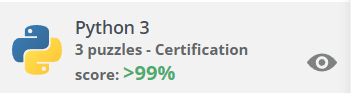

Hey! I'm **SupercraftD**!
However you came across my profile, **welcome**!

(I'm better than 99% of professionals at python)

# What I Do

I'm an indie game developer. I primarily use the Godot game engine with GDScript!

I *love* dabbling in new things, so I often try out new languages, frameworks, and things like that!

That's the reason I know a little of Python, JS, C#, C++, and Go without being too good at any of them!

You can find my itch page at https://supercraftd.itch.io/

I often post there with new games I make!

# What I'm Doing Right Now

I'm currently working on random small projects with p5.js, godot, etc.

Other than that, I work on small projects in Godot, Python, and other! Sometimes I find small GitHub repos and work on them a little bit!

# My Socials

Youtube: [SupercraftD](https://www.youtube.com/channel/UCCiIb9QVbiDhJorashqjVGw)

Twitch: [SupercraftD](https://www.twitch.tv/supercraftd)

Itch: [SupercraftD](https://supercraftd.itch.io/)

# Contact Me
want to work on a project with me? Want me to check out your project? Just want to chat?

Send me a message on any one of my socials
